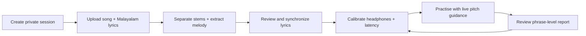
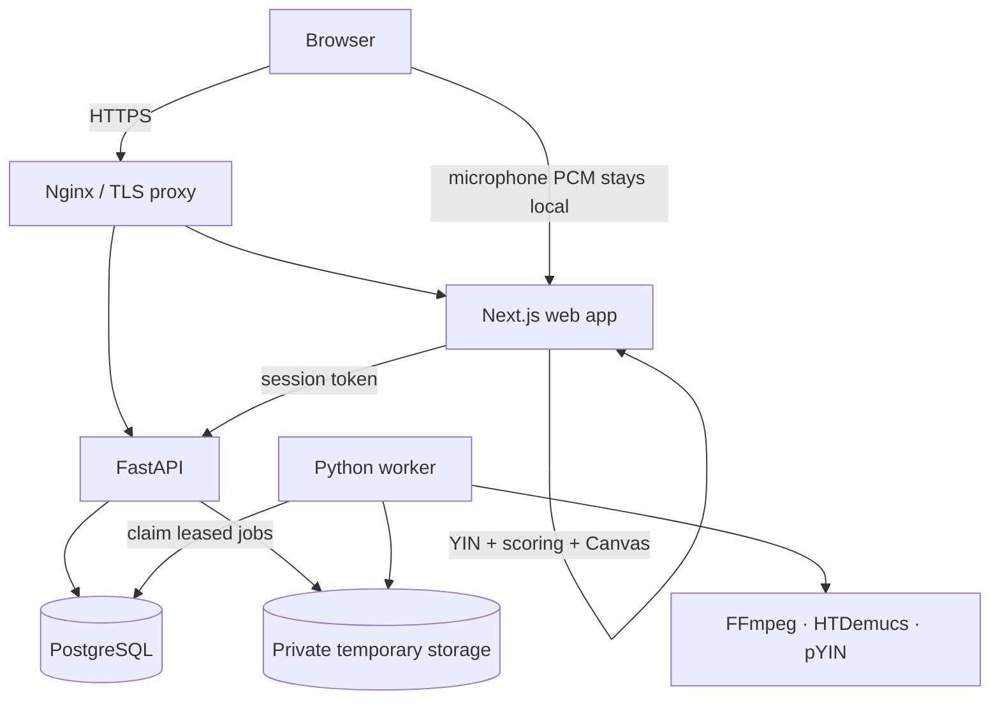

# Swaram

### Private, Malayalam-first singing practice—with feedback that follows your voice.

[](https://github.com/007-Akira/Swaram/actions/workflows/ci.yml)
[](CHANGELOG.md)
[](package.json)
[](pyproject.toml)
[](docs/threat-model.md)

Swaram is an open-source singing coach built specifically for Malayalam music.
Bring a song and lyrics you are authorized to use; Swaram separates the
accompaniment, extracts a reference melody, helps you synchronize each lyric
line, and turns your practice into visual, phrase-level feedback on pitch,
timing, stability, completion, and confidence.

The product is designed around a simple promise: **your practice microphone
audio stays in your browser**. Uploaded source material is isolated inside an
expiring private session, protected by a one-time token, and removable at any
time.

> **Release status:** `0.1.0-rc.1` — under active development. Swaram does not
> bundle, sell, or search for songs or lyrics. Use only material you have the
> right to process.

## Why Swaram?

Most pitch tools assume Western notation, generic vocal exercises, or a
cloud-first workflow. Swaram is built around the actual journey of practising
a Malayalam song:

- **Malayalam-first lyrics** — paste text or import UTF-8 TXT, LRC, and SRT;
  Unicode is normalized and stanza structure is preserved.
- **Practice the song you care about** — upload MP3, WAV, M4A, or FLAC and
  generate an instrumental practice track plus a reference pitch contour.
- **See what to improve** — receive phrase-level coaching for pitch shape,
  timing, stability, coverage, and completion instead of a mysterious single
  score.
- **Keep the microphone private** — live microphone PCM, pitch detection, and
  practice scoring run in the browser; raw practice audio is not uploaded or
  recorded.
- **Stay in control** — sessions expire after 24 hours by default and can be
  deleted immediately from the application.

## The practice journey



1. **Start privately.** The API creates an expiring session and returns its
   secret once. Only a SHA-256 hash is stored on the server.
2. **Prepare the song.** A dedicated worker validates and normalizes the file,
   separates stems with HTDemucs, and extracts a pYIN reference contour.
3. **Align the words.** Review imported timestamps or tap through the song to
   place each Malayalam lyric line precisely.
4. **Calibrate the room.** Check headphone leakage and compensate for device
   latency before scoring begins.
5. **Practise deliberately.** Slow playback, switch between original and
   instrumental modes, loop a line, and follow the live pitch canvas.
6. **Understand the attempt.** Inspect voiced coverage, contour, timing,
   stability, confidence, and phrase-level feedback, then try again.

## Feature highlights

| Area        | What Swaram provides                                                                                                              |
| ----------- | --------------------------------------------------------------------------------------------------------------------------------- |
| Practice    | Live YIN pitch detection, pitch-preserving speed controls, line loops, original/instrumental playback, latency adjustment         |
| Feedback    | Windowed pitch comparison, phrase metrics, weighted scoring, confidence and coverage gates, detailed attempt reports              |
| Lyrics      | Malayalam text validation, TXT/LRC/SRT import, stanza-aware editor, waveform markers, manual synchronization and nudging          |
| Processing  | FFmpeg validation and normalization, HTDemucs stem separation, pYIN reference contour extraction, durable staged jobs             |
| Privacy     | Hashed session tokens, opaque storage keys, authorized byte-range playback, immediate deletion, automatic retention cleanup       |
| Reliability | PostgreSQL leases, retry-safe workers, Alembic migrations, readiness checks, cross-language contracts, unit/integration/E2E tests |
| Operations  | Hardened containers, internal backend network, non-root services, health checks, deployment guide, threat model and runbook       |

## Architecture

Swaram is a TypeScript/Python monorepo with strict boundaries between the
interactive practice loop, private API, and expensive audio analysis.



- The **Next.js application** owns microphone capture, live pitch detection,
  the monotonic practice clock, visualization, and derived scoring.
- **FastAPI** owns session authorization, uploads, private playback, lyrics,
  processing state, attempts, reports, deletion, and operational endpoints.
- The **Python worker** claims jobs with `FOR UPDATE SKIP LOCKED` and performs
  bounded media decoding, normalization, separation, and contour extraction
  outside request handlers.
- **PostgreSQL** is both the system of record and durable job queue; no Redis,
  Celery, RQ, or MinIO is required for the MVP.
- Versioned **TypeScript and Python contracts** independently validate data at
  service boundaries.

Read the full [architecture overview](docs/architecture.md),
[audio-processing contract](docs/audio-processing.md), and
[database design](docs/database.md).

## Repository map

```text
Swaram/
├── apps/web/                 Next.js App Router frontend and browser DSP UI
├── services/api/             FastAPI private-session and reporting API
├── services/worker/          PostgreSQL worker and audio-analysis pipeline
├── packages/audio-core/      Pitch detection, timing, comparison and scoring
├── packages/contracts/       Shared TypeScript/Python data contracts
├── packages/ui/              Shared interface primitives
├── infra/                    Nginx and Docker Compose deployment definitions
├── docs/                     Architecture, security, operations and UX guides
├── scripts/                  Local development helpers
└── tests/                    Repository-level test guidance
```

## Quick start

### Prerequisites

- Node.js 20+
- pnpm 9 (`corepack enable` is the easiest setup)
- Python 3.11+
- PostgreSQL 15+
- FFmpeg for the analysis worker

HTDemucs and its ML dependencies are installed through the worker package.
GPU acceleration is optional; CPU processing is the default.

### 1. Install dependencies

```bash
git clone https://github.com/007-Akira/Swaram.git
cd Swaram

cp .env.example .env
pnpm install --frozen-lockfile

python -m venv .venv
. .venv/bin/activate
python -m pip install \
  -e packages/contracts \
  -e "services/api[dev]" \
  -e "services/worker[dev]"
```

### 2. Start PostgreSQL and migrate

If a compatible local PostgreSQL installation is available, the helper script
can create and manage a project-local development cluster:

```bash
pnpm db:server:start
pnpm db:upgrade
```

Alternatively, set `DATABASE_URL` in `.env` to an existing database before
running `pnpm db:upgrade`.

### 3. Run the application

With the virtual environment activated:

```bash
pnpm dev
```

This starts the web application and API together:

- Web: <http://localhost:3000>
- API health: <http://localhost:8000/health>
- Database readiness: <http://localhost:8000/ready>

Run the worker in another terminal:

```bash
. .venv/bin/activate
.venv/bin/swaram-worker
```

To validate one idle polling cycle and exit, run `pnpm worker:once`.

> API startup intentionally does **not** apply migrations. Database changes
> must always be explicit through `pnpm db:upgrade`.

## Configuration

Copy `.env.example` and adjust the values for your environment. Important
settings include:

| Variable                     | Purpose                                          | Default/example             |
| ---------------------------- | ------------------------------------------------ | --------------------------- |
| `DATABASE_URL`               | PostgreSQL connection used by the API and worker | local `swaram` database     |
| `PRIVATE_DATA_ROOT`          | Root for opaque, temporary private objects       | `./data`                    |
| `CORS_ORIGINS`               | Exact browser origins allowed to call the API    | `http://localhost:3000`     |
| `SESSION_RETENTION_HOURS`    | Lifetime of private sessions                     | `24`                        |
| `UPLOAD_MAX_BYTES`           | API upload ceiling                               | `104857600`                 |
| `AUDIO_MAX_DURATION_SECONDS` | Worker-enforced audio duration ceiling           | `900`                       |
| `STEM_DEVICE`                | HTDemucs execution target                        | `cpu`                       |
| `OPERATIONS_TOKEN`           | Secret for protected operational metrics         | replace in every deployment |

The [configuration reference](docs/configuration.md) documents validation,
storage lifecycle, leases, media bounds, and production requirements.

## Privacy and security model

Privacy is an architectural boundary in Swaram, not just a settings page.

- Raw microphone audio is processed in browser memory and is never uploaded.
- A session token is returned once, held in browser `sessionStorage`, and sent
  through `X-Session-Token`; the database retains only its SHA-256 hash.
- Uploaded assets use random opaque keys below mode-restricted private storage.
- Playback is authorized through the API and supports HTTP byte ranges without
  exposing permanent public URLs or filesystem paths.
- Vocal stems are processing artifacts and are never exposed for download.
- Media is checked at upload and authoritatively decoded under worker-enforced
  size, duration, expanded-PCM, and timeout limits.
- Immediate deletion removes uploads, derivatives, analysis, attempts, lyrics,
  and database records. Scheduled cleanup handles expired sessions safely.
- Operational logs contain identifiers and outcomes—not tokens, lyrics, or
  private file contents.

Review the [threat model](docs/threat-model.md), [security policy](SECURITY.md),
and [accessibility/privacy audit](docs/accessibility-privacy-audit.md) before a
public deployment.

## Quality gates

The default CI pipeline runs Node checks, browser E2E tests, Python unit tests,
and PostgreSQL integration tests in independent jobs. Run the local checks with:

```bash
pnpm lint
pnpm typecheck
pnpm test
pnpm build
pnpm format:check

.venv/bin/ruff check services packages/contracts
.venv/bin/ruff format --check services packages/contracts
.venv/bin/mypy services/api/src services/worker/src packages/contracts/python
.venv/bin/pytest -m "not integration"
```

Browser tests use Playwright:

```bash
pnpm --filter @swaram/web exec playwright install chromium
pnpm test:e2e
```

Database integration tests require an explicitly disposable
`TEST_DATABASE_URL`; see [the database testing guide](docs/database.md).

## Production deployment

The production Compose topology includes an Nginx TLS proxy, read-only web and
API containers, a resource-bounded worker, PostgreSQL, internal backend
networking, dropped Linux capabilities, and persistent private volumes.

Start with the [deployment guide](docs/deployment.md), then use the
[worker deployment guide](docs/worker-deployment.md),
[operations runbook](docs/operations-runbook.md), and
[release checklist](RELEASE_CHECKLIST.md). A production deployment must also
schedule `swaram-cleanup` so expired private sessions are removed.

## Current limitations

- Swaram remains a release candidate and still needs broader physical-device,
  browser, microphone, and Malayalam-song evaluation.
- Stem separation can leave vocal leakage or remove accompaniment detail.
- pYIN can miss breathy, noisy, polyphonic, very low, or very high passages and
  may make octave errors.
- Live YIN accuracy depends on microphone quality, room noise, headphones,
  browser audio behavior, and correct latency calibration.
- Scores are coaching signals—not a judgment of singing ability—and should be
  interpreted alongside coverage and confidence.

The [user guide](docs/user-guide.md) describes supported workflows, formats,
browser requirements, recovery behavior, and known trade-offs in more detail.

## Documentation

| Guide                                                      | Covers                                                      |
| ---------------------------------------------------------- | ----------------------------------------------------------- |
| [User guide](docs/user-guide.md)                           | End-to-end workflow, compatibility and limitations          |
| [Architecture](docs/architecture.md)                       | Components, boundaries and data flow                        |
| [Practice interface](docs/practice-interface.md)           | Playback, loops, calibration and feedback UI                |
| [Browser pitch detection](docs/browser-pitch-detection.md) | YIN framing and sample-rate trade-offs                      |
| [Evaluation](docs/evaluation.md)                           | Generated-signal metrics and Malayalam evaluation protocol  |
| [Threat model](docs/threat-model.md)                       | Assets, controls, trust boundaries and residual risks       |
| [Deployment](docs/deployment.md)                           | Production Compose and VPS procedures                       |
| [Operations runbook](docs/operations-runbook.md)           | Monitoring, incidents, recovery and privacy-safe operations |

## Contributing

Contributions that improve Malayalam-language usability, browser audio
reliability, privacy, accessibility, signal evaluation, or documentation are
welcome. Please read [CONTRIBUTING.md](CONTRIBUTING.md) before opening a change.
Report security issues privately using [SECURITY.md](SECURITY.md).

## Project principles

1. **Private by default.** Collect less, retain briefly, and make deletion real.
2. **Explain the score.** Feedback should teach, not merely rank.
3. **Respect the music.** Swaram is a practice engine, not a content catalogue.
4. **Keep heavy work off requests.** Analysis belongs in durable, bounded jobs.
5. **Test the boundaries.** Audio, authorization, storage, contracts, and
   cleanup deserve the same attention as the interface.

---

Built for singers who want to understand the next phrase not just chase a
number.
