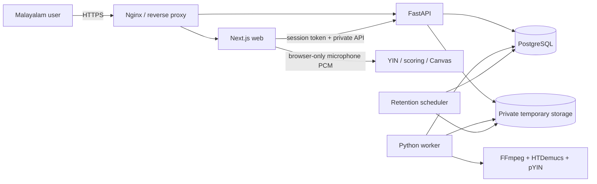

# Architecture

Swaram is a standalone monorepo with independently runnable web, API, worker,
and shared contract/DSP packages.

The browser owns microphone capture, live YIN pitch detection, the monotonic
practice clock, Canvas rendering, and derived scoring. Raw microphone audio
does not leave the browser.

FastAPI owns expiring session authorization, metadata, uploads, Malayalam
lyrics, private playback, analysis retrieval, reports, deletion, readiness,
and protected operational metrics. It checks upload size, signature, declared
MIME, and extension but does not decode media or run ML.

The dedicated Python worker claims PostgreSQL jobs using `FOR UPDATE SKIP
LOCKED`, authoritatively validates/normalizes audio with FFmpeg, separates
stems with pretrained HTDemucs, extracts pYIN reference contours, and
publishes a versioned analysis package. Heavy processing never runs in an API
request handler.

Private user objects live below an opaque, session-scoped filesystem adapter.
Only original and instrumental assets have authorized playback routes; vocals
are never downloadable. Explicit deletion and the scheduled retention command
remove the database graph and private directory.

Applications and services may depend on shared packages. Shared packages do
not import application/service internals, and the worker does not import API
implementation modules. TypeScript and Python contract models validate the
analysis boundary independently.
